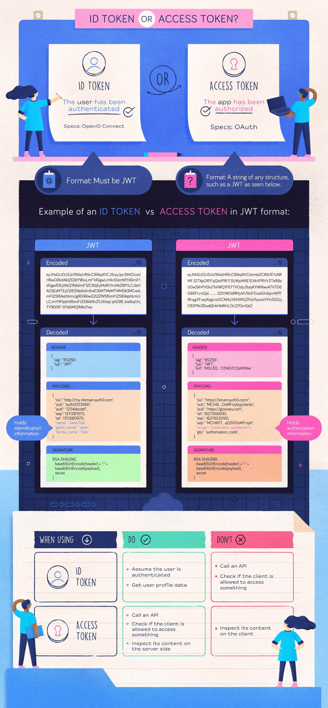

= Keycloak Playground

image::images/keycloak_logo_200px.svg[float="right"]

Open Source Identity and Access Management

Add authentication to applications and secure services with minimum effort.
No need to deal with storing users or authenticating users.

Keycloak provides user federation, strong authentication, user management, fine-grained authorization, and more.

https://www.keycloak.org/[keycloak.org]

- https://www.keycloak.org/guides#getting-started[Getting started]
- https://www.keycloak.org/server/containers[Running Keycloak in a container]
- https://www.keycloak.org/docs/latest/authorization_services/index.html[Authorization Services Guide]

== How this project is setting up Keycloak

NOTE: The two containers `postgres-keycloak-playground` and `keycloak-playground` need to be started in same network

=== Start Postgres

.First time we start Postgres
[source,bash]
----
cd containers
./start_postgres_for_keycloak.sh
----

.Subsequently when we have to start Postgres
[source,bash]
----
podman start postgres-keycloak-playground
----

=== Start Keycloak

NOTE: We need to have `fullchain.pem` and `privkey.pem` where the script `build_images.sh` can find them

.First time we start Keycloak
[source,bash]
----
cd containers
./build_images.sh
./start_postgres_for_keycloak.sh
----

.Subsequently when we have to start Keycloak
[source,bash]
----
podman start keycloak-playground
----

== Intro to OAuth / OpenID Connect

.Access Tokens
[quote]
Access tokens are what the OAuth client uses to make requests to an API. The access token is meant to be read and validated by the API.

.ID Tokens
[quote]
An ID token contains information about what happened when a user authenticated, and is intended to be read by the OAuth client. The ID token may also contain information about the user such as their name or email address, although that is not a requirement of an ID token.

.ID Tokens vs Access Tokens
[quote]
What's the difference between an ID Token and an Access Token? Access tokens are defined in OAuth, ID tokens are defined in OpenID Connect.

.Here are some further differences between ID tokens and access tokens
[quote]
⬩ ID tokens are meant to be read by the OAuth client. Access tokens are meant to be read by the resource server. +
⬩ ID tokens are JWTs. Access tokens can be JWTs but may also be a random string. +
⬩ ID tokens should never be sent to an API. Access tokens should never be read by the client.

Sources for quotes : https://oauth.net/2/access-tokens/[OAuth 2.0 / Access Tokens] and https://oauth.net/id-tokens-vs-access-tokens/[ID Tokens vs Access Tokens]

.Further reading about the topic
- https://fusionauth.io/learn/expert-advice/oauth/modern-guide-to-oauth[The Modern Guide to OAuth]
- https://oauth.net/2/[OAuth 2.0]
- https://oauth.net/2/grant-types/[OAuth 2.0 / Grant Types]
- https://oauth.net/2/access-tokens/[OAuth 2.0 /Access Tokens]
- https://oauth.net/id-tokens-vs-access-tokens/[ID Tokens vs Access Tokens]

https://alexbilbie.github.io/guide-to-oauth-2-grants/#which-oauth-20-grant-should-i-use[Which OAuth 2.0 grant should I use?] can help you pick a Grant Type, but remember `Implicit Grant` and `Password Grant` is Legacy.

=== auth0.com on ID Token, Access Token and Scope

- https://auth0.com/docs/secure/tokens/id-tokens[auth0.com ~ ID Tokens]
- https://auth0.com/docs/secure/tokens/access-tokens[auth0.com ~ Access Tokens]
- https://auth0.com/docs/get-started/apis/scopes[auth0.com ~ Scopes]
    * https://auth0.com/docs/get-started/apis/scopes/api-scopes[API Scopes]
    * https://auth0.com/docs/get-started/apis/scopes/openid-connect-scopes[OpenID Connect Scopes]
    * https://auth0.com/docs/get-started/apis/scopes/sample-use-cases-scopes-and-claims[Sample Use Cases: Scopes and Claims]

https://auth0.com/blog/id-token-access-token-what-is-the-difference/[auth0.com ~ ID Token and Access Token: What's the Difference?] is a very nice blog post get get you head around ID Token and Access Token.

https://www.youtube.com/watch?v=vVM1Tpu9QB4[YouTube ~ ID Token and Access Token: What's the Difference?]

video::vVM1Tpu9QB4[youtube, width=640, height=480]

== Get a Token

.Display the content of .access_token
[source,bash]
----
echo $access_token | jq -R 'split(".") | .[0],.[1] | @base64d | fromjson'
----

=== Authorization Code Grant

[quote]
The Authorization Code grant type is used by confidential and public clients to exchange an authorization code for an access token. +
After the user returns to the client via the redirect URL, the application will get the authorization code from the URL and use it to request an access token. +
It is recommended that all clients use the PKCE extension with this flow as well to provide better security.

.Open in a Browser to do login
[source,bash]
----
https://keycloak.jarry.dk:8543/realms/playground/protocol/openid-connect/auth
?client_id=demo-authorization-code
&response_type=code
&scope=profile
&redirect_uri=http://localhost:8081/callback&
&state=fj8o3n7bdy1op5
----

NOTE: Time for some copy/paste - You need to get the `code` from the url in you browser.

.Get .access_token (Authorization Code Grant)
[source,bash]
----
curl -X POST https://keycloak.jarry.dk:8543/realms/playground/protocol/openid-connect/token \
	-H 'Content-Type: application/x-www-form-urlencoded' \
	-d 'grant_type=authorization_code' \
	-d 'client_id=demo-authorization-code' \
	-d 'client_secret=IbECWf3EZQEi8HSUkS9BiTYtoQKLCU9B' \
	-d 'code=8759bef0-1342-4aa6-8088-e087b8528c98.bb547f78-2676-44f3-960a-c99900810cc4.7e7908bb-5447-4aea-9217-07b96a2fb1de' \
	-d 'redirect_uri=http://localhost:8081/callback'
----

=== Client Credentials Grant

[quote]
The Client Credentials grant type is used by clients to obtain an access token outside of the context of a user. +
This is typically used by clients to access resources about themselves rather than to access a user's resources.

.Get .access_token (Client Credentials Grant)
[source,bash]
----
curl -X POST https://keycloak.jarry.dk:8543/realms/playground/protocol/openid-connect/token \
	-H 'Content-Type: application/x-www-form-urlencoded' \
	-d 'client_id=demo-client-credentials' \
	-d 'client_secret=GzvczB7hiWSy3ldmxwYahlvTgXg08hwz' \
	-d 'scope=email' \
	-d 'grant_type=client_credentials'
----

.Get .access_token (Client Credentials Grant - parse client_id and client_secret as Basic access authorization)
[source,bash]
----
curl -X POST https://keycloak.jarry.dk:8543/realms/playground/protocol/openid-connect/token \
	-H 'Content-Type: application/x-www-form-urlencoded' \
    --user demo-client-credentials:GzvczB7hiWSy3ldmxwYahlvTgXg08hwz \
	-d 'scope=email' \
	-d 'grant_type=client_credentials'
----

.Get token human readable (Client Credentials Grant - parse client_id and client_secret as Basic access authorization)
----
jwt-decode $(\
    curl -X POST https://keycloak.jarry.dk:8543/realms/playground/protocol/openid-connect/token \
    -H 'Content-Type: application/x-www-form-urlencoded' \
    --user demo-client-credentials:GzvczB7hiWSy3ldmxwYahlvTgXg08hwz \
    -d 'scope=email' \
    -d 'grant_type=client_credentials' | jq --raw-output '.access_token'\
    )
----

=== Device Authorization Grant

[quote]
 The OAuth 2.0 device authorization grant is designed for Internet-
   connected devices that either lack a browser to perform a user-agent-
   based authorization or are input constrained to the extent that
   requiring the user to input text in order to authenticate during the
   authorization flow is impractical.  It enables OAuth clients on such
   devices (like smart TVs, media consoles, digital picture frames, and
   printers) to obtain user authorization to access protected resources
   by using a user agent on a separate device.

- http://www.keycloak.org/keycloak-community/specifications/[keycloak-community / Specifications]
- https://github.com/keycloak/keycloak-community/blob/main/design/oauth2-device-authorization-grant.md[OAuth 2.0 Device Authorization Grant]
- https://thomaslevesque.com/2020/03/28/using-the-oauth-2-0-device-flow-to-authenticate-users-in-desktop-apps/[Using the OAuth 2.0 device flow to authenticate users in desktop apps]
- https://learn.microsoft.com/en-us/azure/active-directory/develop/v2-oauth2-device-code[Microsoft identity platform and the OAuth 2.0 device authorization grant flow]
- https://www.oauth.com/oauth2-servers/device-flow/token-request/[Token Request]
- https://datatracker.ietf.org/doc/html/rfc8628[OAuth 2.0 Device Authorization Grant]

.Request init - Client authentication on
[source,bash]
----
curl -X POST \
    --user demo-device-authorization-grant:FmTgJmFPKGHUy31UxtyrC17mQFh9a7OQ \
    -d 'scope=email rl' \
    https://keycloak.jarry.dk:8543/realms/playground/protocol/openid-connect/auth/device | jq
----

NOTE: Scope is set to `email rl`

.Response - init
[source,json]
----
{
  "device_code": "zMIVwHfMRUAfR_8aAz0L_evw_rG0t2auAzT56mU76JI",
  "user_code": "IHQH-OYIU",
  "verification_uri": "https://keycloak.jarry.dk:8543/realms/playground/device",
  "verification_uri_complete": "https://keycloak.jarry.dk:8543/realms/playground/device?user_code=IHQH-OYIU",
  "expires_in": 600,
  "interval": 5
}
----

Open the content of `verification_uri_complet` or open the content of `verification_uri` and use `user_code` in a browser  - accept all. Now you can get the `Token` based on the `device_code`. 

.Request get token - Client authentication on
[source,bash]
----
curl -X POST \
    --user demo-device-authorization-grant:FmTgJmFPKGHUy31UxtyrC17mQFh9a7OQ \
    -d "device_code=nTFVlUHj9fk6oy2onZe9kbcd3D_RkQJjr-w8Rk1KcSY" \
    -d "grant_type=urn:ietf:params:oauth:grant-type:device_code" \
    https://keycloak.jarry.dk:8543/realms/playground/protocol/openid-connect/token | jq
----

.Response - get token
[source,json]
----
{
  "access_token": "eyJhbGciOiJSUzI1NiIsInR5cCIgOiAiSldUIiwia2lkIiA6ICJyUVFxZlQ3TVZEYTZrQUxRVVF3SjI2WlN4VzdDa05HRF9kTHJHaUdidmk0In0.eyJleHAiOjE2ODYyOTYyMTQsImlhdCI6MTY4NjI5NTkxNCwiYXV0aF90aW1lIjoxNjg2Mjk1MjgxLCJqdGkiOiJkMDUzOTZhNy1hMDFiLTQxZDQtYTMwMC1iMzhlYWQ0MzNlNDgiLCJpc3MiOiJodHRwczovL2tleWNsb2FrLmphcnJ5LmRrOjg1NDMvcmVhbG1zL3BsYXlncm91bmQiLCJhdWQiOlsia29ydHZpc2VyIiwiZ2Vvc2VydmVyLWNsaWVudCIsImFjY291bnQiXSwic3ViIjoiMDk3OWJiYmItMjZmOC00ZjAzLTg5MGYtOTRlOWUzNTk4NDljIiwidHlwIjoiQmVhcmVyIiwiYXpwIjoiZGVtby1kZXZpY2UtYXV0aG9yaXphdGlvbi1ncmFudCIsInNlc3Npb25fc3RhdGUiOiIxNjEwZjA2Ni03MjExLTRjNTQtYTM4Ny04ZGY3ZTUxYjhiODMiLCJhY3IiOiIwIiwiYWxsb3dlZC1vcmlnaW5zIjpbIi8qIl0sInJlYWxtX2FjY2VzcyI6eyJyb2xlcyI6WyJkZWZhdWx0LXJvbGVzLXBsYXlncm91bmQiLCJvZmZsaW5lX2FjY2VzcyIsImFkbWluIiwidW1hX2F1dGhvcml6YXRpb24iXX0sInJlc291cmNlX2FjY2VzcyI6eyJrb3J0dmlzZXIiOnsicm9sZXMiOlsicmVhZCIsImFkbWluIl19LCJnZW9zZXJ2ZXItY2xpZW50Ijp7InJvbGVzIjpbIkFETUlOSVNUUkFUT1IiLCJBRE1JTiJdfSwiYWNjb3VudCI6eyJyb2xlcyI6WyJtYW5hZ2UtYWNjb3VudCIsIm1hbmFnZS1hY2NvdW50LWxpbmtzIiwidmlldy1wcm9maWxlIl19fSwic2NvcGUiOiJlbWFpbCBwcm9maWxlIHJsIiwic2lkIjoiMTYxMGYwNjYtNzIxMS00YzU0LWEzODctOGRmN2U1MWI4YjgzIiwiZW1haWxfdmVyaWZpZWQiOnRydWUsInJvbGVzIjp7ImtvcnR2aXNlciI6WyJyZWFkIiwiYWRtaW4iXSwiZ2Vvc2VydmVyLWNsaWVudCI6WyJBRE1JTklTVFJBVE9SIiwiQURNSU4iXSwiYWNjb3VudCI6WyJtYW5hZ2UtYWNjb3VudCIsIm1hbmFnZS1hY2NvdW50LWxpbmtzIiwidmlldy1wcm9maWxlIl19LCJuYW1lIjoiTWljaGFlbCBCb3JuaG9sZHQgTmllbHNlbiIsInByZWZlcnJlZF91c2VybmFtZSI6Im1pY2JuIiwiZ2l2ZW5fbmFtZSI6Ik1pY2hhZWwgQm9ybmhvbGR0IiwiZmFtaWx5X25hbWUiOiJOaWVsc2VuIiwiZW1haWwiOiJtaWNibkByZWRwaWxsLWxpbnByby5jb20ifQ.dJRl2TiW-uuKCaZmcNKJ8n133gKngVBVXsOfWWQZ5vct5CPkIrLxCbZ35s7mfDc_LxMJeMmbSG2FTN9-VgQ7qPlF2B2ne8rqfGMKfO2qkTOVB_TmHA9lMhjn_Mst8tBE91SOi5jBpl4BSI1nNnWHwSvid_hbL86X-ynjsubDnYuXxtqi2oo98VIYOJJg6crmIUmFl_4v6aR_d5k8ZBQ2dRenTqI7LWkcnZ58Eidh3PXdlxXux5zleV1w8Z7VBCaR-PTvtQqtXIqKT_U_p3qIIoF0LktWbaMPGc0E1rb-L-sNRKBD3xPviX3qQa-fnWgPeWDLpdXE67JwDDU8-N8zWQ",
  "expires_in": 300,
  "refresh_expires_in": 1800,
  "refresh_token": "eyJhbGciOiJIUzI1NiIsInR5cCIgOiAiSldUIiwia2lkIiA6ICJiZTZmOTJhYS01Y2EwLTQzMjEtYTE0NS0wNjJjYjFhZTQxYzIifQ.eyJleHAiOjE2ODYyOTc3MTQsImlhdCI6MTY4NjI5NTkxNCwianRpIjoiN2ExODhkZDktNWYyMi00ZDhlLWE0YzAtNmNmZWMyMjU1YjM5IiwiaXNzIjoiaHR0cHM6Ly9rZXljbG9hay5qYXJyeS5kazo4NTQzL3JlYWxtcy9wbGF5Z3JvdW5kIiwiYXVkIjoiaHR0cHM6Ly9rZXljbG9hay5qYXJyeS5kazo4NTQzL3JlYWxtcy9wbGF5Z3JvdW5kIiwic3ViIjoiMDk3OWJiYmItMjZmOC00ZjAzLTg5MGYtOTRlOWUzNTk4NDljIiwidHlwIjoiUmVmcmVzaCIsImF6cCI6ImRlbW8tZGV2aWNlLWF1dGhvcml6YXRpb24tZ3JhbnQiLCJzZXNzaW9uX3N0YXRlIjoiMTYxMGYwNjYtNzIxMS00YzU0LWEzODctOGRmN2U1MWI4YjgzIiwic2NvcGUiOiJlbWFpbCBwcm9maWxlIHJsIiwic2lkIjoiMTYxMGYwNjYtNzIxMS00YzU0LWEzODctOGRmN2U1MWI4YjgzIn0.exk6pHfu-NXZg8djqa1qE2q_DmZ-Yq1bmUtb0U-u5Zc",
  "token_type": "Bearer",
  "not-before-policy": 0,
  "session_state": "1610f066-7211-4c54-a387-8df7e51b8b83",
  "scope": "email profile rl"
}

----

=== Password Grant

[quote]
The Password grant type is a legacy way to exchange a user's credentials for an access token. Because the client application has to collect the user's password and send it to the authorization server, *it is not recommended that this grant be used at all anymore*.

.Get .access_token (Password Grant - Client authentication turned off)
[source,bash]
----
export access_token=$(\
curl -X POST https://keycloak.jarry.dk:8543/realms/playground/protocol/openid-connect/token \
	-H 'Content-Type: application/x-www-form-urlencoded' \
	-d 'password=change_me' \
	-d 'username=micbn' \
	-d 'client_id=demo-password-grant' \
	-d 'grant_type=password'
)
----

.Get .access_token (Password Grant - Client authentication turned on)
[source,bash]
----
export access_token=$(\
curl -X POST https://keycloak.jarry.dk:8543/realms/playground/protocol/openid-connect/token \
    --user todo-playground-service:todo-playground-service-secret \
    -H 'content-type: application/x-www-form-urlencoded' \
    -d 'username=micbn&password=change_me&grant_type=password' | jq --raw-output '.access_token' \
)
----

=== Refreshing Access Token

[quote]
The refresh token can be used to refresh an access token, only if the refresh token has not expired yet. If the refresh token has expired, it can no longer be used.

.Request
[source,bash]
----
curl -X POST https://keycloak.jarry.dk:8543/realms/playground/protocol/openid-connect/token \
    --user todo-playground-service:todo-playground-service-secret \
    -H 'Content-Type: application/x-www-form-urlencoded' \
    --data-urlencode 'grant_type=refresh_token' \
    --data-urlencode 'refresh_token=eyJhbGciOiJIUzI1NiIsInR5cCIgOiAiSldUIiwia2lkIiA6ICJiZTZmOTJhYS01Y2EwLTQzMjEtYTE0NS0wNjJjYjFhZTQxYzIifQ.eyJleHAiOjE2ODY5MDMyMzgsImlhdCI6MTY4NjkwMTQzOCwianRpIjoiYmYxNDhmYjctODY1My00ZDA3LWJlZmEtOTgwMTk4MzFkY2I0IiwiaXNzIjoiaHR0cHM6Ly9rZXljbG9hay5qYXJyeS5kazo4NTQzL3JlYWxtcy9wbGF5Z3JvdW5kIiwiYXVkIjoiaHR0cHM6Ly9rZXljbG9hay5qYXJyeS5kazo4NTQzL3JlYWxtcy9wbGF5Z3JvdW5kIiwic3ViIjoiMDk3OWJiYmItMjZmOC00ZjAzLTg5MGYtOTRlOWUzNTk4NDljIiwidHlwIjoiUmVmcmVzaCIsImF6cCI6InRvZG8tcGxheWdyb3VuZC1zZXJ2aWNlIiwic2Vzc2lvbl9zdGF0ZSI6ImQ3Mjk4YTE0LTA0OGQtNDk0Yy1iNDE3LTFkY2E0OTM0MGU4MCIsInNjb3BlIjoiZW1haWwgcHJvZmlsZSIsInNpZCI6ImQ3Mjk4YTE0LTA0OGQtNDk0Yy1iNDE3LTFkY2E0OTM0MGU4MCJ9.aRg5aGQ-32pDDTA45R5MWP0Xa2sdIBzaSxfwvNWw2D4'
----

.Response
[source,json]
----
{
  "access_token": "eyJhbGciOiJSUzI1NiIsInR5cCIgOiAiSldUIiwia2lkIiA6ICJyUVFxZlQ3TVZEYTZrQUxRVVF3SjI2WlN4VzdDa05HRF9kTHJHaUdidmk0In0.eyJleHAiOjE2ODY5MDE3NzksImlhdCI6MTY4NjkwMTQ3OSwianRpIjoiNDVmZTkxZjgtYTQ5My00MjZmLWJkY2ItYTI1OTkzY2NjMWEwIiwiaXNzIjoiaHR0cHM6Ly9rZXljbG9hay5qYXJyeS5kazo4NTQzL3JlYWxtcy9wbGF5Z3JvdW5kIiwiYXVkIjpbImtvcnR2aXNlciIsImdlb3NlcnZlci1jbGllbnQiLCJhY2NvdW50Il0sInN1YiI6IjA5NzliYmJiLTI2ZjgtNGYwMy04OTBmLTk0ZTllMzU5ODQ5YyIsInR5cCI6IkJlYXJlciIsImF6cCI6InRvZG8tcGxheWdyb3VuZC1zZXJ2aWNlIiwic2Vzc2lvbl9zdGF0ZSI6ImQ3Mjk4YTE0LTA0OGQtNDk0Yy1iNDE3LTFkY2E0OTM0MGU4MCIsImFjciI6IjEiLCJhbGxvd2VkLW9yaWdpbnMiOlsiKiJdLCJyZWFsbV9hY2Nlc3MiOnsicm9sZXMiOlsiZGVmYXVsdC1yb2xlcy1wbGF5Z3JvdW5kIiwib2ZmbGluZV9hY2Nlc3MiLCJhZG1pbiIsInVtYV9hdXRob3JpemF0aW9uIl19LCJyZXNvdXJjZV9hY2Nlc3MiOnsia29ydHZpc2VyIjp7InJvbGVzIjpbInJlYWQiLCJhZG1pbiJdfSwiZ2Vvc2VydmVyLWNsaWVudCI6eyJyb2xlcyI6WyJBRE1JTklTVFJBVE9SIiwiQURNSU4iXX0sImFjY291bnQiOnsicm9sZXMiOlsibWFuYWdlLWFjY291bnQiLCJtYW5hZ2UtYWNjb3VudC1saW5rcyIsInZpZXctcHJvZmlsZSJdfX0sInNjb3BlIjoiZW1haWwgcHJvZmlsZSIsInNpZCI6ImQ3Mjk4YTE0LTA0OGQtNDk0Yy1iNDE3LTFkY2E0OTM0MGU4MCIsImVtYWlsX3ZlcmlmaWVkIjp0cnVlLCJuYW1lIjoiTWljaGFlbCBCb3JuaG9sZHQgTmllbHNlbiIsInByZWZlcnJlZF91c2VybmFtZSI6Im1pY2JuIiwiZ2l2ZW5fbmFtZSI6Ik1pY2hhZWwgQm9ybmhvbGR0IiwiZmFtaWx5X25hbWUiOiJOaWVsc2VuIiwiZW1haWwiOiJtaWNibkByZWRwaWxsLWxpbnByby5jb20ifQ.nlYtV9PfK7OuPVup1GuJiooVkvalADzGqjr27JhQXbJN1v15aa5sI_16248rpmtKlTOCnR1wzVNuIEGcERKbOpejGqzTWYOWvgB3Hyyv1cyGpeHknp-zSOkwpJSN8Kp4CE29NMt9UbM7l8DDe3r-ZtrJz3mue6epLkl52T0spgq-IjIfriTkMOSmVk-31qnTxCrWlJcs18ZUBU819h8pARzJlFFq_RdYZQO0nb9b6RU_hqGew_0VHz3YFYx9462RcijuucHjGBaYy6a3rCSjAzmDJHW1mmhi5vd4G-1HMj5dB1R_gLtlR0IahwbkdnflptxuA0kyu3H92Ba0iyRHfg",
  "expires_in": 300,
  "refresh_expires_in": 1800,
  "refresh_token": "eyJhbGciOiJIUzI1NiIsInR5cCIgOiAiSldUIiwia2lkIiA6ICJiZTZmOTJhYS01Y2EwLTQzMjEtYTE0NS0wNjJjYjFhZTQxYzIifQ.eyJleHAiOjE2ODY5MDMyNzksImlhdCI6MTY4NjkwMTQ3OSwianRpIjoiM2RiMDkzNWMtNzA1NC00YTEzLWE2OTUtMThjOWFlYzRiODg5IiwiaXNzIjoiaHR0cHM6Ly9rZXljbG9hay5qYXJyeS5kazo4NTQzL3JlYWxtcy9wbGF5Z3JvdW5kIiwiYXVkIjoiaHR0cHM6Ly9rZXljbG9hay5qYXJyeS5kazo4NTQzL3JlYWxtcy9wbGF5Z3JvdW5kIiwic3ViIjoiMDk3OWJiYmItMjZmOC00ZjAzLTg5MGYtOTRlOWUzNTk4NDljIiwidHlwIjoiUmVmcmVzaCIsImF6cCI6InRvZG8tcGxheWdyb3VuZC1zZXJ2aWNlIiwic2Vzc2lvbl9zdGF0ZSI6ImQ3Mjk4YTE0LTA0OGQtNDk0Yy1iNDE3LTFkY2E0OTM0MGU4MCIsInNjb3BlIjoiZW1haWwgcHJvZmlsZSIsInNpZCI6ImQ3Mjk4YTE0LTA0OGQtNDk0Yy1iNDE3LTFkY2E0OTM0MGU4MCJ9.pX7HiK0j6Ee6MkSgFNTbTWP5qjAZ8f223wAmYk2kYQs",
  "token_type": "Bearer",
  "not-before-policy": 0,
  "session_state": "d7298a14-048d-494c-b417-1dca49340e80",
  "scope": "email profile"
}
----

== Grant types (appsdeveloperblog.com)

link:GrantTypesByAppsDeveloperBlog.adoc[] contains extracts from a serie of blogs by https://www.appsdeveloperblog.com/author/sergey/[Sergey Kargopolov].

== MitID broker

.digst.dk
- https://digst.dk/it-loesninger/mitid/nyheder-om-mitid/nyheder-fra-2021/11-brokere-i-mitid/[11 brokere i MitID]
- https://digst.dk/it-loesninger/mitid/nyheder-om-mitid/nyheder-fra-2021/nu-er-der-fem-mitid-brokere-paa-banen/[Nu er der fem MitID-brokere på banen]
- https://digst.dk/it-loesninger/nemlog-in/om-loesningen/aendring-i-funktionaliteter/implementeringssite/[Implementering af MitID og NemLog-in3]
- https://digst.dk/it-loesninger/mitid/nyheder-om-mitid/nyheder-fra-2020/mitid-priser-for-det-foerste-aar-er-nu-fastlagt/[MitID-priser for det første år er nu fastlagt]

.Signaturgruppen A/S
- https://broker.signaturgruppen.dk/[Om Nets eID Broker :: Signaturgruppen A/S]
- https://broker.signaturgruppen.dk/teknisk-dokumentation[Teknisk dokumentation]
- https://broker.signaturgruppen.dk/teknisk-dokumentation/demo-projekt[MitID og NemID - demo-projekt]
- https://github.com/Signaturgruppen-A-S/nets-eID-broker-demo
- https://github.com/Signaturgruppen-A-S/netseidbroker-dotnet-demo

- https://broker.signaturgruppen.dk/teknisk-dokumentation/demo-projekt
- https://pp.netseidbroker.dk/op/.well-known/openid-configuration
- https://pp.netseidbroker.dk/op/connect/authorize?client_id=0a775a87-878c-4b83-abe3-ee29c720c3e7&redirect_uri=https://keycloak.jarry.dk:8543/realms/playground/broker/signaturgruppen-hybrid/endpoint&response_type=code&scope=openid mitid

.User
----
Budur10132
----

.criipto
- https://www.criipto.com/mitid/[Danish MitID]
- https://docs.criipto.com/verify/e-ids/danish-mitid/[Danish MitID - Documentation]
- https://www.criipto.com/pricing/authentication[Pricing for Authentication]
- https://docs.criipto.com/verify/integrations/aspnet-core-v6/[Integrations - ASP.NET Core 6.0]
    * https://github.com/criipto/samples/tree/master/Verify/dotnet-core-v6.x

=== NSIS / NemLog-in

[quote]
En broker er en betroet tjeneste (trusted third party), der videreformidler brugerautentifikationer til andre organisationers tjenester ved at udstede egne autentifikationsbilletter, som disse tjenester stoler på. Man bliver således ikke broker ved at foretage en intern konvertering i en tjeneste af autentifikationssvaret fra NemLog-in til fx en browser cookie eller et internt access token. +
Brokere kan tilslutte et it-system til NemLog-in og derigennem videreformidle NemLog-in autentifikationer samt erhvervsidentiteter til egne, bagvedliggende tjenesteudbydere. Herved bliver brokeren en såkaldt `sub-broker`. NemLog-in er selv en broker for MitID autentifikationer - en såkaldt MitID-broker. +
Tilslutning af en broker til NemLog-in forudsætter blandt andet NSIS-anmeldelse af brokeren og indgåelse af en brokeraftale med Digitaliseringsstyrelsen. Dette gælder uanset om brokeren i forvejen er certificeret MitID broker.

Source : https://broker.nemlog-in.dk/forside/

.broker.nemlog-in.dk
- https://broker.nemlog-in.dk/forside/[Information til brokere]
- https://broker.nemlog-in.dk/tilslutning/[Tilslutningsforløb]
- https://broker.nemlog-in.dk/dokumentation-og-integration/[Dokumentation og integration ]
    * https://cms.nemlog-in.dk/media/rapjnunv/integration-with-nemlog-in-for-brokers.pdf[Integration with NemLog-in for brokers]
- https://tu.nemlog-in.dk/oprettelse-og-administration-af-tjenester/[Oprettelse og administration af tjenester]

.tu.nemlog-in.dk
- https://tu.nemlog-in.dk/forside/[Information om NemLog-in som den offentlige broker af MitID]
- https://tu.nemlog-in.dk/tilslutning/[Tilslutning til NemLog-in]

.nemlog-in.dk
- https://migrering.nemlog-in.dk/
- https://migrering.nemlog-in.dk/kontakt-og-support/infovideoer-og-webinarer/[Infovideoer og webinarer]
- https://migrering.nemlog-in.dk/nemlog-in-broker/privat-tjenesteudbyder/[Privat tjenesteudbyder]
- https://migrering.nemlog-in.dk/nemlog-in-broker/privat-tjenesteudbyder/nsis/[Privat tjenesteudbyder - NSIS]
    * https://digst.dk/it-loesninger/standarder/nsis/
- https://migrering.nemlog-in.dk/nemlog-in-broker/offentlig-tjenesteudbyder/[Offentlig tjenesteudbyder]
- https://www.nemlog-in.dk/login/om-login/[Om Login]
- https://www.nemlog-in.dk/media/xopg0xfb/5c6d9ea3-e1a1-4f95-80be-31658bc8eb21.pdf[Tekniske krav til Brokeres anvendelse af NemLog-in3]

.digst.dk
- https://digst.dk/it-loesninger/nemlog-in/om-loesningen/
- https://digst.dk/it-loesninger/nemlog-in/om-loesningen/aendring-i-funktionaliteter/implementeringssite/infrastrukturbeskrivelse/[Fremtidens infrastruktur for digitale identiteter i Danmark]
    * https://digst.dk/it-loesninger/nemlog-in/om-loesningen/aendring-i-funktionaliteter/implementeringssite/infrastrukturbeskrivelse/udbuddene-kort-fortalt/[Udbuddene kort fortalt]
    * https://digst.dk/it-loesninger/mitid/om-mitid/[Om MitID]
    * https://digst.dk/it-loesninger/nemlog-in/om-loesningen/aendring-i-funktionaliteter/implementeringssite/infrastrukturbeskrivelse/nemlog-in3-projektet/[NemLog-in3-projektet]
- https://digst.dk/it-loesninger/nemlog-in/om-loesningen/nyheder-om-nemlog-in/danske-virksomheder-kan-faa-mitid-erhverv-fra-oktober-2022/[Danske virksomheder kan få MitID Erhverv fra oktober 2022]

[quote]
Der er på sigt planer om, at NemLog-in kan agere som broker for lokale Identity Providers (IdP) – reguleret inden for rammerne af NSIS-standarden. Dette tænkes realiseret ved, at der åbnes for føderering mellem NemLog-in og andre IdP’er. Herved opnås på sigt mulighed for autentifikation med andet end MitID identifikationsmidler– fx elektroniske identifikationsmidler udstedt lokalt i en organisation, der har sin egen Identity Provider.

Source : https://digst.dk/it-loesninger/nemlog-in/om-loesningen/aendring-i-funktionaliteter/implementeringssite/infrastrukturbeskrivelse/nemlog-in3-projektet/

.mitid-erhverv.dk
- https://www.mitid-erhverv.dk/startside/
- https://www.mitid-erhverv.dk/avanceret/lokal-idm/[Lokal IdM - MitID Erhverv]
- https://www.mitid-erhverv.dk/avanceret/lokal-idp/[Lokal Identity Provider (Lokal IdP)]

.youtube.com
- https://www.youtube.com/watch?v=S9BpeOmuEz4[https://www.youtube.com/watch?v=S9BpeOmuEz4]

.Search on google.com
- https://www.google.com/search?client=firefox-b-d&q=%22NemLog-in%22+%22keycloak%22["NemLog-in" "keycloak"]

== Serviceplatformen

.serviceplatformen.dk
- https://www.serviceplatformen.dk/administration/help/about-login[Serviceplatformen - Om login]
- https://github.com/Serviceplatformen/demoservice-client-java
- https://github.com/Serviceplatformen/demoservice-client-net

.digst.dk
https://digst.dk/it-loesninger/standarder/oiosaml-profiler/[OIOSAML profiler]

.digitaliseringskataloget.dk
- https://digitaliseringskataloget.dk/l%C3%B8sninger/administrationsmodul[Fælleskommunalt Administrationsmodul]
- https://digitaliseringskataloget.dk/files/integration-files/160320231503/Brugervejledning%20til%20Administrationsmodulerne%20for%20leverand%C3%B8rer.pdf[Brugervejledning til Administrationsmodulerne for
leverandører]
- https://digitaliseringskataloget.dk/files/2022-08/Fremtidens%20infrastruktur%20er%20%C3%A5ben-Infrastrukturdagen2022.pdf[FREMTIDENS INFRASTRUKTUR ER ÅBEN / Kommunernes Data- og Infrastrukturdag 2022]
- https://digitaliseringskataloget.dk/l%C3%B8sninger/adgangsstyring-brugere[Adgangsstyring for brugere]
    * https://digitaliseringskataloget.dk/files/integration-files/031120201924/Vejledning%20til%20adgangsstyring%20for%20brugere.pdf[Vejledning til adgangsstyring for brugere]
    * https://digitaliseringskataloget.dk/files/integration-files/170820211628/Kom%20godt%20i%20gang%20-%20Tilslut%20Brugervendt%20System.pdf[Kom godt i gang - Tilslut Brugervendt System]
    * https://digitaliseringskataloget.dk/files/integration-files/191220221055/Vejledning%20til%20Ops%C3%A6tning%20af%20Identity%20Provider.pdf[Vejledning til Opsætning af Identity Provider]

.github.com
 - https://github.com/Serviceplatformen
 - https://github.com/digst

.For SAML mapping - KeyCloak
- https://www.keycloak.org/docs/latest/server_development/#_providers
    * https://www.keycloak.org/server/configuration-provider
    * https://www.keycloak.org/docs/latest/server_development/#_saml_role_mappings_spi
- https://www.keycloak.org/docs/latest/server_admin/#saml-v2-0-identity-providers
- https://github.com/redhat-italy/keycloak-spid-provider
- https://github.com/italia/spid-keycloak-provider
    * https://github.com/italia/spid-keycloak-provider/wiki/Generating-SP-metadata
    * https://github.com/hakancoruhh/keycloak-steam-openid
    * https://www.baeldung.com/java-keycloak-custom-user-providers

- https://lists.jboss.org/pipermail/keycloak-user/2017-April/010289.html
    * https://lists.jboss.org/archives/search?q=SAML+attribute+mapper+with+processing
- https://viden.stil.dk/display/OFFSKOLELOGIN/Tilslut+tjeneste
- https://viden.stil.dk/display/OFFSKOLELOGIN/Implementering+af+eksempel+tjeneste
- https://docplayer.net/16926163-Oiosaml-2-0-toolkits-test-results-may-2009.html
- https://www.samltool.com/decode.php
- https://www.keycloak.org/docs/latest/server_admin/#saml-v2-0-identity-providers

=== stoettesystemerne.dk

SAML-metadata for Context Handler nederst på siden Adgangsstyring for brugere
- https://adgangsstyring.eksterntest-stoettesystemerne.dk/runtime/saml2/metadata.idp
- https://adgangsstyring.stoettesystemerne.dk/runtime/saml2/metadata.idp

Metadata til nuværende version af Context Handler
Eksternt testmiljø: https://adgangsstyring.eksterntest-stoettesystemerne.dk/runtime/saml2auth/metadata.idp
Produktionsmiljø: https://adgangsstyring.stoettesystemerne.dk/runtime/saml2auth/metadata.idp

Metadata til NSIS-Context Handler (kommende version i 2022)
Eksternt testmiljø: https://n2adgangsstyring.eksterntest-stoettesystemerne.dk/runtime/saml2auth/metadata.idp
Produktionsmiljø: https://n2adgangsstyring.stoettesystemerne.dk/runtime/saml2auth/metadata.idp

== Keycloak and Azure AD

[quote]
Lightweight Directory Access Protocol (LDAP) is an application protocol for working with various directory services. Directory services, such as Active Directory, store user and account information, and security information like passwords. The service then allows the information to be shared with other devices on the network. Enterprise applications such as email, customer relationship managers (CRMs), and Human Resources (HR) software can use LDAP to authenticate, access, and find information. +
  +
Azure Active Directory (Azure AD) supports this pattern via Azure AD Domain Services (AD DS). It allows organizations that are adopting a cloud-first strategy to modernize their environment by moving off their on-premises LDAP resources to the cloud. The immediate benefits will be: +
    ✗ Integrated with Azure AD. Additions of users and groups, or attribute changes to their objects are automatically synchronized from your Azure AD tenant to AD DS. Changes to objects in on-premises Active Directory are synchronized to Azure AD, and then to AD DS. +
    ✗ Simplify operations. Reduces the need to manually keep and patch on-premises infrastructures. +
    ✗ Reliable. You get managed, highly available services

----
Azure AD Domain Services (AD DS):
Performs a one-way synchronization from Azure AD to provide access to a central set of users, groups, and credentials. The AD DS instance is assigned to a virtual network. Applications, services, and VMs in Azure that connect to the virtual network assigned to AD DS can use common AD DS features such as LDAP, domain join, group policy, Kerberos, and NTLM authentication.
----

Source : https://learn.microsoft.com/en-us/azure/active-directory/fundamentals/auth-ldap[LDAP authentication with Azure Active Directory]

.Keyclaok
- https://www.keycloak.org/docs/latest/server_admin/index.html#_user-storage-federation[Using external storage (federation)]

.Azure AD as a brokered Identity Provider in KeyCloak
- https://www.youtube.com/watch?v=LYF-NLHD2uQ[KEYCLOAK & Azure AD - How to configure AAD as an Identity Provider]
- https://www.alphabold.com/azure-ad-configuration/[Configure Azure AD as a brokered Identity Provider in KeyCloak]
- https://www.grebintegration.dk/2021/03/07/microsoft-azure-active-directory-as-keycloak-identity-provider/[Microsoft Azure Active Directory as KeyCloak Identity Provider]
- https://keycloak.discourse.group/t/groups-from-azure-ad/4876[Groups from Azure AD]
- https://keycloak.discourse.group/t/getting-groups-from-azure-active-directory-idp/590[Getting groups from Azure Active Directory IDP]
- https://stackoverflow.com/questions/64334364/get-azure-groups-information-in-keycloak-id-token[Get Azure groups information in keycloak id_token]

.SSO (SAML 2.0)
- https://learn.microsoft.com/en-us/azure/active-directory/hybrid/connect/how-to-connect-fed-saml-idp[Use a SAML 2.0 Identity Provider (IdP) for Single Sign On]
- https://learn.microsoft.com/en-us/answers/questions/1189374/using-azure-ad-as-an-identity-provider-in-keycloak[Using Azure AD as an identity provider in Keycloak-based applications: how can I add missing user data to my client applications?]

.ADFS
- https://www.alphabold.com/ms-adfs-configuration-in-keycloak/[Configure MS ADFS as a brokered Identity Provider in KeyCloak]
- https://www.redhat.com/sysadmin/active-directory-sso-authentication[How to integrate Active Directory Federation Services (ADFS) authentication with Red Hat SSO using SAML]
- https://www.keycloak.org/2017/03/how-to-setup-ms-ad-fs-30-as-brokered[How to Setup MS AD FS 3.0 as Brokered Identity Provider in Keycloak]
- https://learn.microsoft.com/en-us/windows-server/identity/ad-fs/deployment/how-to-connect-fed-azure-adfs[Deploying Active Directory Federation Services in Azure]
- https://learn.microsoft.com/en-us/azure/active-directory/hybrid/connect/whatis-fed[What is federation with Azure AD?]

.stackoverflow.com
- https://stackoverflow.com/questions/75206593/what-is-the-best-way-to-federate-users-from-azure-ad-to-keycloak[What is the best way to federate users from Azure AD to Keycloak?]
- https://stackoverflow.com/questions/66151538/how-to-synchronize-microsoft-users-from-azure-into-the-keycloak[How to synchronize Microsoft users from Azure into the Keycloak]

.Other links
- https://www.securew2.com/blog/use-azure-ad-ldap[Can I use Azure AD with LDAP? ]
- https://suryaprakash-pandey.medium.com/azure-ad-idp-with-keycloak-as-sp-1ca933d71388[Azure AD iDP with Keycloak as SP]
- https://learn.microsoft.com/en-us/answers/questions/1189374/using-azure-ad-as-an-identity-provider-in-keycloak[Using Azure AD as an identity provider in Keycloak-based applications: how can I add missing user data to my client applications?]
- https://keycloak.discourse.group/t/what-is-the-best-way-to-federate-users-from-azure-ad-to-keycloak/20374/10[What is the best way to federate users from Azure AD to Keycloak?]
- https://www.grebintegration.dk/2021/03/07/microsoft-azure-active-directory-as-keycloak-identity-provider/

== C# / ASP.NET

.Packages
- https://www.nuget.org/packages/Microsoft.AspNetCore.Authentication.OpenIdConnect#versions-body-tab
    * https://learn.microsoft.com/en-us/dotnet/api/microsoft.aspnetcore.authentication.openidconnect?view=aspnetcore-6.0
- https://www.nuget.org/packages/Microsoft.AspNetCore.Authentication.JwtBearer#versions-body-tab
    * https://learn.microsoft.com/en-us/dotnet/api/microsoft.aspnetcore.authentication.jwtbearer?view=aspnetcore-6.0
- https://www.nuget.org/packages/Microsoft.IdentityModel.Protocols.OpenIdConnect#versions-body-tab
- https://www.nuget.org/packages/Microsoft.AspNetCore.Identity/#versions-body-tab

.learn.microsoft.com 
- https://learn.microsoft.com/en-us/aspnet/core/security/authentication/?view=aspnetcore-6.0[Overview of ASP.NET Core authentication]
- https://learn.microsoft.com/en-us/aspnet/core/security/authentication/claims?view=aspnetcore-6.0[Mapping, customizing, and transforming claims in ASP.NET Core]

- https://learn.microsoft.com/en-us/aspnet/core/security/authorization/introduction?view=aspnetcore-6.0[Introduction to authorization in ASP.NET Core]
- https://learn.microsoft.com/en-us/aspnet/core/security/authorization/secure-data?view=aspnetcore-6.0[Create an ASP.NET Core web app with user data protected by authorization]
- https://learn.microsoft.com/en-us/aspnet/core/security/authorization/roles?view=aspnetcore-6.0[Role-based authorization in ASP.NET Core]

.Source code
https://github.com/dotnet/AspNetCore.Docs/tree/main/aspnetcore/security/authentication

.Guids
- https://github.com/tuxiem/AspNetCore-keycloak[ASP.NET Core - Keycloak authorization guide]
- https://damienbod.com/2022/05/02/implement-an-openiddict-identity-provider-using-asp-net-core-identity-with-keycloak-federation/[Implement an OpenIddict identity provider using ASP.NET Core Identity with Keycloak federation]
    * https://github.com/damienbod/AspNetCoreOpeniddict
- https://medium.com/geekculture/swagger-with-bearer-token-net6-b4ca5a8274b1[Swagger with Bearer Token .Net6] 

=== Create a web API with ASP.NET Core - TodoApi

.How to create a TodoApi webapp
----
dotnet new webapi -o TodoApi
cd TodoApi
----

.How to add Microsoft.AspNetCore.Authentication.JwtBearer to the project
----
dotnet add package Microsoft.AspNetCore.Authentication.JwtBearer --version 6.0.13
----

In Visual Studio Code
- Press Ctrl+F5 to run the app.

.Links
- https://learn.microsoft.com/en-us/aspnet/core/tutorials/first-web-api?view=aspnetcore-6.0[Tutorial: Create a web API with ASP.NET Core (6.0)]
- https://systemweakness.com/security-in-react-and-webapi-in-asp-net-core-c-with-authentification-and-authorization-by-keycloak-1d076777a979[Part One: Security with Keycloak in React and Web Api in ASP.NET Core 5.0 C# with authentication and authorization]
- https://blog.devgenius.io/security-in-react-and-webapi-in-asp-net-core-c-with-authentification-and-authorization-by-keycloak-89ba14be7e5a[Part Two: Securing a front-end React application]
- https://blog.devgenius.io/security-in-react-and-webapi-in-asp-net-core-c-with-authentification-and-authorization-by-keycloak-f890d340d093[Part Three: Securing the ASP.NET Core C# REST Web API]
- https://blog.devgenius.io/part-four-security-in-react-and-webapi-in-asp-net-b6dffd3b7624[Part Four: Calling the protected Web API from the React SPA with the access JWT Token Bearer Authorization]
- https://procodeguide.com/programming/oauth2-and-openid-connect-in-aspnet-core/[Secure Applications with OAuth2 and OpenID Connect in ASP.NET Core 5 – Complete Guide]
    * https://github.com/procodeguide/ProCodeGuide.Samples.IdentityServer4[ProCodeGuide.Samples.IdentityServer4]
- https://procodeguide.com/programming/aspnet-core-identity-roles-authorization/[ASP.NET Core Identity Roles based Authorization]
    * https://github.com/procodeguide/Samples.Identity.Claims[Samples.Identity.Claims]
- https://stackoverflow.com/questions/53702555/cant-access-roles-in-jwt-token-net-core[Can't access Roles in JWT Token .NET Core]
- https://usmanshahid.medium.com/levels-of-access-control-through-keycloak-part-3-access-control-through-roles-and-tokens-a1744c04895e[Levels of Access Control through Keycloak Part 3: Access Control Through Roles and Tokens]